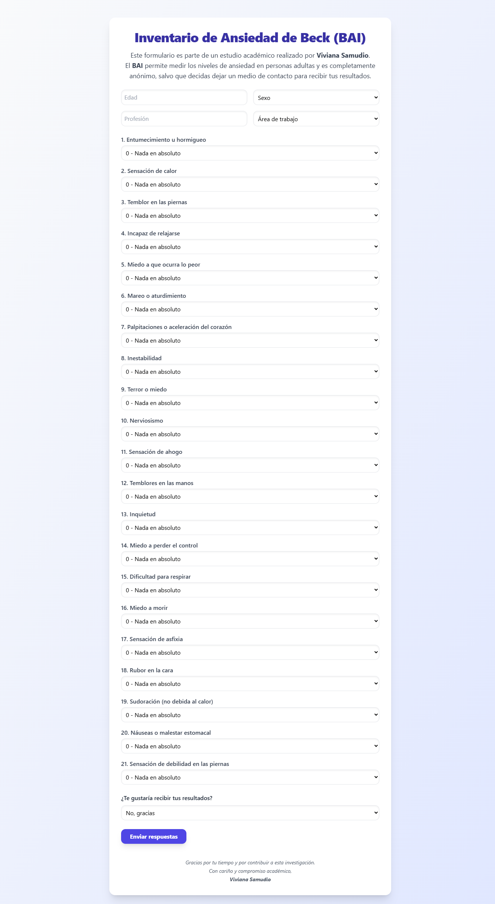
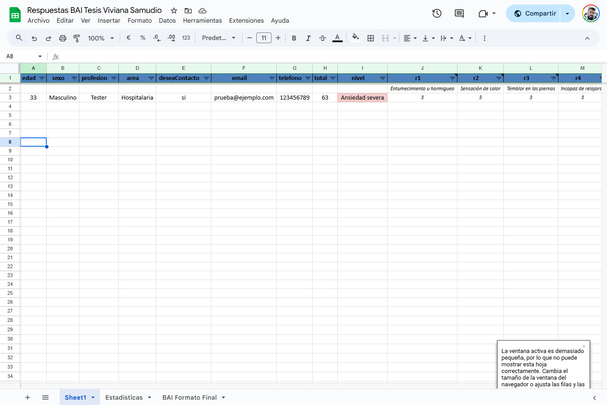

# Inventario de Ansiedad de Beck (BAI)

Formulario web interactivo y responsivo para medir niveles de ansiedad en personas adultas, basado en el Inventario de Ansiedad de Beck. Los resultados se almacenan automáticamente en Google Sheets a través de una API externa (SheetBest).

Creado para la tesis de Viviana Samudio.

## Capturas

### Vista del formulario



### Análisis personalizado luego de enviar



## Funcionalidades

- Formulario completo con 21 preguntas del BAI.
- Puntaje total y diagnóstico automático.
- Análisis personalizado basado en perfil de respuestas.
- Diseño moderno con Tailwind CSS.
- Almacenamiento automático en Google Sheets (sin backend).
- Responsive: usable desde celular, tablet o PC.

## Tecnologías

- HTML + JavaScript puro
- Tailwind CSS
- SheetBest API (con Google Sheets)
- Vercel (hosting gratuito con GitHub)

## Clonar y desplegar

1. Cloná el repositorio:
   ```bash
   git clone https://github.com/generiz/formularioBAI
   cd formulario-bai
   ```

2. Subilo a Vercel (https://vercel.com), conectando tu cuenta de GitHub.

3. Configurá tu propia hoja de cálculo en [SheetBest](https://sheet.best) y reemplazá la URL en el archivo `index.html`.

4. ¡Listo! Ya podés compartir el link de tu formulario.

## Créditos

Este formulario fue desarrollado por [Nicolás Pintos](https://www.nicolaspintos.com) para la tesis académica de Viviana Samudio.

